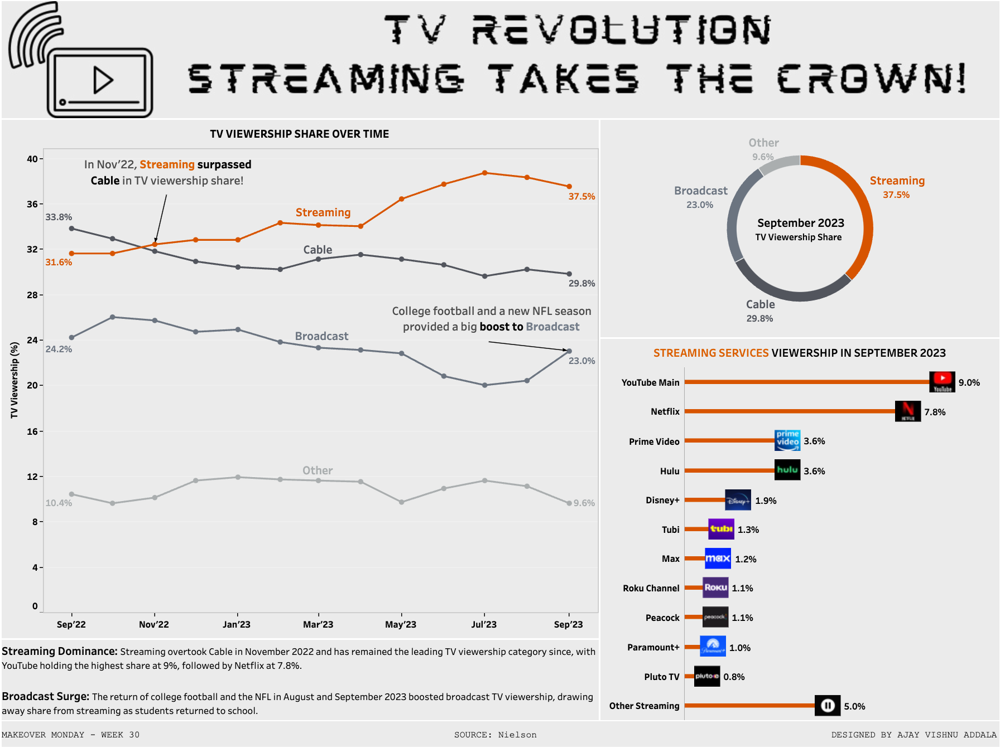

# TV Viewership Trends: September 2022 - September 2023

## Overview

This Tableau visualization analyzes TV viewership trends from September 2022 to September 2023, highlighting the rise of streaming, the impact of sports on broadcast viewership, and detailed insights into different streaming platforms.

## Key Highlights

- **Streaming Dominance**: Streaming overtook Cable in November 2022 and has maintained the top spot. YouTube holds the highest share at 9%, followed by Netflix at 7.8%.
- **Broadcast Surge**: The return of college football and the NFL in August and September 2023 significantly boosted broadcast TV viewership, drawing away share from streaming as students returned to school.

## Visualization

[View the Tableau Dashboard](https://public.tableau.com/views/StreamingtakesthecrownMOM2024Week30/Streaming?:language=en-US&:sid=&:redirect=auth&:display_count=n&:origin=viz_share_link)

## Detailed Insights

- **TV Viewership Share**: Shows viewership distribution across Streaming, Cable, Broadcast, and Other from September 2022 to September 2023. This highlights the moment when streaming surpassed cable in November 2022.
- **Category Share in September 2023**: A donut chart illustrating the TV share by category in September 2023, with Streaming having the highest share.
- **Streaming Platforms Breakdown**: A bar chart detailing the viewership distribution among different streaming platforms in September 2023.

## Tooltips

Updated tooltips provide month-on-month changes and additional insights for a deeper understanding of the trends.

